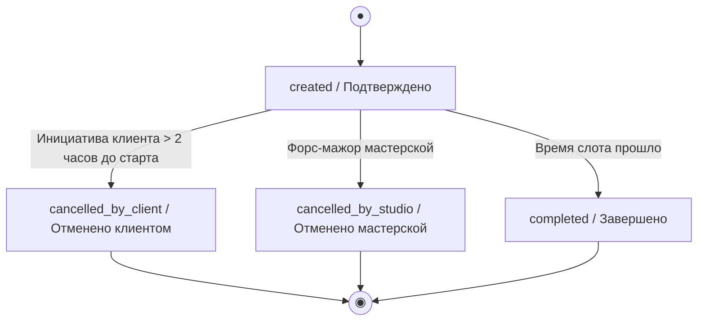

# Модель данных и бизнес-инварианты

> Этап 2. Архитектура и проектирование. Описание ключевых ресурсов API, атрибутов, ограничений целостности и жизненного цикла сущностей мобильного приложения для гончарной мастерской «Глина».
> 
> **Специфика интеграции:**
> - Клиентское приложение является потребителем API. Существующий бэкенд выступает в роли Black-Box и является единственным источником истины.
> - Ресурсы `Program`, `Master`, `Slot` доступны клиенту строго в режиме Read-Only.
> - Ресурсы `Client` и `Booking` поддерживают операции создания и модификации в рамках разрешенных сценариев.

## Сущности и атрибутивный состав ресурсов API

### Client (Профиль клиента)
| Атрибут | Тип | Описание |
| :-- | :-- | :-- |
| `id` | UUID (PK) | Уникальный идентификатор клиента |
| `phone` | string | Номер телефона (уникальный, формат +7XXXXXXXXXX) |
| `first_name` | string | Имя пользователя |
| `is_loyal` | boolean | Флаг постоянного клиента (true — отображать плашку «Постоянный клиент») |

### Program (Программа / Мастер-класс)
| Атрибут | Тип | Описание |
| :-- | :-- | :-- |
| `id` | UUID (PK) | Уникальный идентификатор программы |
| `title` | string | Название (например, «Простая лепка для новичков», «Работа на гончарном круге») |
| `description`| text | Подробное описание программы и результатов |
| `duration_min`| integer| Длительность занятия в минутах (120–150 минут) |
| `base_price` | decimal | Базовая стоимость участия в рублях |
| `type` | enum | Тип сложности (`LEPKA` / `KRUG`) |

### Master (Мастер / Инструктор)
| Атрибут | Тип | Описание |
| :-- | :-- | :-- |
| `id` | UUID (PK) | Уникальный идентификатор мастера |
| `first_name` | string | Имя мастера |
| `last_name` | string | Фамилия мастера |
| `avatar_url` | string | Ссылка на изображение профиля мастера |
| `rating` | float | Средний рейтинг мастера (от 1.0 до 5.0) на основе оценок |

### Slot (Слот в расписании)
| Атрибут | Тип | Описание |
| :-- | :-- | :-- |
| `id` | UUID (PK) | Уникальный идентификатор сессии |
| `program_id` | UUID (FK) | Ссылка на Программу |
| `master_id` | UUID (FK) | Ссылка на назначенного Мастера |
| `start_at` | datetime | Дата и время начала занятия (UTC) |
| `end_at` | datetime | Дата и время окончания занятия (UTC) |
| `total_seats`| integer | Максимальная вместимость слота (6 для новичков, до 10 для кругов) |
| `free_seats` | integer | Количество доступных для бронирования мест |
| `status` | enum | Статус доступности слота (`available`, `full`, `cancelled_by_studio`) |

### Booking (Бронирование / Запись)
| Атрибут | Тип | Описание |
| :-- | :-- | :-- |
| `id` | UUID (PK) | Уникальный идентификатор записи |
| `client_id` | UUID (FK) | Ссылка на авторизованного Клиента |
| `slot_id` | UUID (FK) | Ссылка на забронированный Слот |
| `needs_rent` | boolean | Флаг заказа проката (инструменты + защитный фартук) |
| `status` | enum | Текущий статус записи (см. жизненный цикл) |
| `created_at` | datetime | Время создания бронирования |

---

## Жизненный цикл бронирования (Booking Statuses)

Переходы между статусами сущности `Booking` осуществляются на стороне бэкенда в результате действий клиента или администратора мастерской.

| Статус | Системный код | Отображение в интерфейсе клиента | Возможность отмены |
| :-- | :-- | :-- | :-- |
| Подтверждено | `created` | «Запись подтверждена» | Да (если до начала > 2 часов) |
| Отменено клиентом | `cancelled_by_client`| «Отменено вами» | Нет |
| Отменено студией | `cancelled_by_studio`| «Отменено мастерской (причина)»| Нет |
| Завершено | `completed` | «Мастер-класс пройден» | Нет (доступна оценка мастера) |

---

## Ключевые инварианты и правила целостности

1. **Расчет свободных мест:** Количество свободных мест на слоте (`Slot.free_seats`) динамически рассчитывается на сервере:
   `Slot.free_seats = Slot.total_seats - count(Bookings где Booking.slot_id == Slot.id И Booking.status == 'created')`
   При `free_seats == 0` статус слота автоматически переходит in `full`, и запись блокируется.

2. **Валидация вместимости группы:**
   Максимальный лимит мест `Slot.total_seats` жестко привязан к типу программы (`Program.type`):
   - Если `type == LEPKA`, то `total_seats <= 6` (ограничение зоны ручной лепки).
   - Если `type == KRUG`, то `total_seats <= 10` (ограничение по числу физических гончарных кругов).

3. **Ограничение фонда проката:**
   Для MVP запас инструментов и фартуков на складе считается условно бесконечным, физический учет остатков единиц инвентаря на уровне слота не требуется. Контролируется только базовый флаг `needs_rent`.
